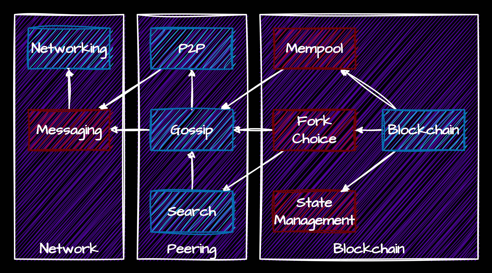

# Let's make some money - Blockchain workshop

## Introduction

This workshop is designed to give you a deeper understanding how decentralized systems work and how to build your own blockchain. We will start with simple networking primitives, build some decentralized communication primitives on top of those, and finally build a simple blockchain.

## Prerequisites

- Basic understanding of Python
- Basic understanding of networking
- Basic understanding of cryptography

## System overview



The system consists of multiple components, which use the abstractions provided by the underlying system, and build more complex systems on top of them.

### The network layer

For the network layer, your task will be to build a simple UDP networking handler, that can send and receive opaque byte blocks.

Over that, you will be provided with a simple messaging layer, that will handle message serialization and deserialization, registration of handlers for specific message kinds, and sending and receiving messages.

### The peering layer

For the peering layer, your task will be to build a simple peering handler, that will allow nodes to connect to each other, and maintain a list of peers. The number of peers per node is limited, to prevent any single node from being overwhelmed.

On top of that, you will build a simple gossip layer, that will allow nodes to broadcast messages to each other, even if they are not directly connected, by passing the messages through the network.

On top of that, you will also build a simple unstructured search algorithm, that will allow nodes to search for specific objects in the network.

### The blockchain layer

For the blockchain layer, you will be provided with the most of the "dirty" stuff: 
* the state management component, which hangles persistence of the blockchain,
* the mempool component, which handles discovery of the transactions that are not yet in the blockchain,
* the fork choice component, which handles the selection of the correct chain in case of a fork

Your task will be to implement the core of the blockchain: 
* the state transition function, which given a block and the current state of the blockchain, will return the new state of the blockchain,
* the block building function, which given the current state of the blockchain and the mempool (list of all transactions), will return a new block that can be added to the blockchain.


# Part 1: Networking

## Introduction

In this part we will build a simple networking layer that will allow us to send messages between nodes. The networking layer will be based on the `socket` module in Python, UDP protocol, and will be able to send and receive messages.

## Your task

In the file [networking.py](bcws/networking.py) you will find a skeleton of a `UDPNode` class. This class should implement a simple UDP networking layer that will allow us to send and receive messages between nodes.

Your task is to implement this class. The class should have the following methods:

* `__init__` - a constructor that should initialize the socked and bind it to the given port. The arguments are:
  * `port: int` - the port to bind the socket to. You should listen on all addresses.
  * `handler: UDPHandler` - an object that will handle incoming messages. You must call this objects `handle_receive(data, peer)` method when a message is received.
* `start` - a method that starts the node in the background. This method should start a new thread that will listen for incoming messages.
* `send` - a method that sends a message to a given address. The arguments are:
  * `peer: UDPPeer` - the address to send the message to.
  * `data: bytes` - the data to send.

# Part 2: Messaging

To simplify the communication between nodes, we will introduce a simple messaging abstraction over the raw UDP layer. Each message sent will contain the **message kind** and **message payload**. The kind is a string identifying the type of the message, and the payload is the actual data.

You can use the `UDPMessaging` class to send and receive messages. To send the message simply construct it using the `UDPMessage` constructor, and send it using the `send` method:

```python
messaging = UDPMessaging(1234)
message = UDPMessage('hello', ['some', 'data', 'here'])
messaging.send(UDPPeer('192.168.10.1', 1235), message)
```

To receive the message, you first have to register the message handler. The handler will be invoked whenever a message is received. It must be a function that takes two arguments: the received message and the peer that sent the message.

```python
def _handle_hello(message: UDPMessage, peer: UDPPeer):
  print(f'Received message from {peer}: {message.kind} {message.data}')

messaging.register('hello', _handle_hello)
```

For each message kind, we will define the format of the payload as it is introduced.

Multiple systems will later on implement a similar `kind`/`payload`/`register` based system, so it is important to understand how it works.

# Part 3: Peering

## Introduction

Peering is a process of connecting multiple nodes together in a peer-to-peer network. In this part we will build a simple peering layer that will allow us to connect multiple nodes together into a mesh network.

Each node has a unique identifier, and maintains a list of peers. When a node connects to another node, it sends an `p2p:announce` message to the other node, which should add the sender as a peer. The receiver should also respond with an `p2p:announce` message, so that the sender can add the receiver as a peer.

The nodes can send eachother `p2p:ask_for_peers` to ask for the list of peers of the other node. The receiver should respond with a `p2p:peers` message, containing the addresses of its peers.

### Messages involved

We will use a number of messages with the following kinds:

* `p2p:announce` - the sender announces itself to the receiver, who should add it as a peer. Payload: `id: str`.
* `p2p:ask_for_peers` - the sender asks the receiver for the list of its peers. Payload: `None`.
* `p2p:peers` - the sender is sending its list of peers to the receiver. Payload: `peers: List[str]`. Send as an answer to `p2p:ask_for_peers`.
* `p2p:ping` - the sender is pinging the receiver to check if it is still alive. Payload: `None`.
* `p2p:pong` - the sender is responding to the ping. Payload: `None`. Sent as an answer to `p2p:ping`.

## Your task

In the file [peering.py](bcws/peering.py) you will find a skeleton of a `P2PNetwork` class. This class should implement a simple peering layer that will allow us to connect multiple nodes together.

Your task is to implement this class. The class should have the following methods:

* `__init__` - a constructor that should initialize the network. The arguments are:
  * `messaging: UDPMessaging` - a messaging layer that will be used to send and receive messages.
  * `peer_limit: int` - the maximum number of peers that can be connected to this node.
* `announce_to` - a method that should announce this node to a given address, and ask for the peer's peers. The arguments are:
  * `peer: UDPPeer` - the peer to announce to.
* `add_peer` - a method that should add a peer to the list of our peers. It just takes the `peer: P2PPeer` as an argument. Make sure that:
  * We are not connected to the same peer multiple times.
  * We are not connected to ourselves.
  * We are not connected to more peers than `peer_limit`. If we would exceed the limit, we should disconnect from one of the peers at random.
  * After we connect to the peer, we should announce ourselves to the peer, just in case they don't know about us yet.
* `start` - a method that should start the network in the background. In the background process, we should periodically:
  * ping all of our peers to check if they are still alive.
  * remove all peers that we haven't seen for a while.
* `send` - a method that should send a message to a given peer. The arguments are:
  * `peer: P2PPeer` - the peer to send the message to.
  * `data: UDPMessage` - the message to send.
* `broadcast` - a method that should send a message to all of our peers. The arguments are:
  * `data: UDPMessage` - the message to send.

# Part 4: Gossip

## Introduction

Gossip is a simple protocol that allows nodes to share information with each other, even if they are not directly connected. In this part we will build a simplified gossip layer that will allow us to share messages between nodes.

Each node maintains a list of messages that it has seen. When a node receives a new message (via a `gossip:send`), it should add it to the list of seen messages, and broadcast it to all of its peers.

Gossip is implemented similarly to messaging, where each message has a kind and a payload, and you register handlers for specific kinds. Note that it still uses the previously implemented messaging layer, wrapping each gossip message in a `gossip:send` UDP message (which is then wrapped in a UDP packet (which is then wrapped in an IP packet (which is then wrapped in an Ethernet frame (and its turtles all the way down)))).

Each message contains a unique identifier, which is the SHA256 hash of the message kind and payload. This identifier is then used to check if we have already seen the message. This also means that the users of the gossip layer should not send the same message multiple times, as it will be ignored.

## Your task

In the file [gossip.py](bcws/gossip.py) you will find a skeleton of a `Gossip` class. This class should implement a simple gossip layer that will allow us to share messages between nodes. Your task is to implement this class. The class should have the following methods:

* `__init__` - a constructor that should initialize the gossip layer. The arguments are:
  * `messaging: UDPMessaging` - a messaging layer that will be used to send and receive messages.
  * `network: P2PNetwork` - the reference to the peering network, for peer management.
* `start` - a method that should start the gossip layer in the background. In the background process, we should periodically time out messages we received more than `message_timeout` seconds ago.
* `broadcast` - a method that should broadcast a message to the entire network, by gossiping it to all of our peers. The argument is `message: GossipMessage`.

# Part 5: Search

## Introduction

In this part we will build a simple unstructured search layer that will allow us to search for messages in the network. The search layer will be built on top of the gossip layer, and will allow us to search for arbitrary objects on the network.

The search consists of two parts: a query and a response. The nodes in a network can send a `search:query` message to all of their peers, asking if they have a specific object. The nodes that have the object should respond with a `search:response` message.

Similarly to messaging, we can search for multiple kinds of objects, each identified with its own `kind`. For each kind, we will define what the query and response payloads should look like. Here we will have two different kinds of registrations: a query handler (that returns the searched object if we have it) and a response handler (that will handle responses to a particular query). Query handlers are registered on the Search object directly, while response handlers are registered along with the query.

Registering a response handler is optional, and by default unsolicited responses will be ignored.

```python
def _handle_object_query(query: Any) -> Any:
  # This function should return the object if we have it, or None if we don't.
  return None

search = Search(gossip)
search.register('object', _handle_object_query)
```

We can also search for individual objects, and register a handler for the response to that specific query:

```python
def _handle_object_response(response: Any) -> bool:
  # This function should handle the response to the query.
  # Return `True` if we want to stop searching.
  pass

search.search_for('object', 'some_query', _handle_object_response)
```

### Gossip messages involved

We will use the follwing gossip messages:

* `search:query` - the sender is asking if the receiver has a specific object. Each query is identified with a unique ID, and the query. Payload: `[id: str, kind: str, query: Any]`.
* `search:response` - the sender is responding to the query, saying that it has the object. Payload: `[id: str, data: Any]`.

## Your task

In the file [search.py](bcws/search.py) you will find a skeleton of a `Search` class. This class should implement a simple search layer that will allow us to search for messages in the network.

Your task is to implement this class. The class should have the following methods:

* `__init__` - a constructor that should initialize the search layer. The arguments are:
  * `gossip: Gossip` - a gossip layer that will be used to send and receive messages.
* `start` - a method that should start the search layer in the background. In the background process, we should periodically time out queries we sent more than `query_timeout` seconds ago.
* `register` - a method that should register a query handler for a specific kind of object. The arguments are:
  * `kind: str` - the kind of object we are searching for.
  * `handler: (Any) -> Any` - a function that should return the object if we have it, or `None` if we don't.
* `search_for` - a method that should send a query to the entire network, asking if anyone has the object. The arguments are:
  * `kind: str` - the kind of object we are searching for.
  * `query: Any` - the query. Exact format depends on the kind.
  * `handler: (Any) -> bool` - a function that should handle the response to the query. If it returns `True`, the search will stop, and the handler will be removed. Otherwise, this is not the exact object we were searching for, and we should continue searching.
  * `timeout` - the timeout for the search in seconds. When we reach this timeout, we should stop searching regardless of the results, and invoke `handler(None)` to let the caller know that we didn't find the object.

# Part 6: Blockchain

## Introduction

In this part we will build a simple blockchain layer that will allow us to store and share blocks between nodes. The blockchain layer will be built on top of the search and gossip layers, and will allow us to store and retrieve blocks from the network.

The blockchain we will be making is very simple. Each block contains:
* The hash of the previous block.
* A `nonce` that is used in POW. The hash of the block has to start with `difficulty` number of zeros, and changing the `nonce` is used to achieve that.
* The block `number`, which must be increasing.
* The `miner` address that will receive the block reward.
* A list of transactions. Each transaction contains:
  * A sender address.
  * A receiver address.
  * The amount of money sent.
  * The sender's `nonce` to prevent replay attacks.
  * The sender's signature to prove that the transaction is valid.

The state of the blockchain is a simple dictionary that maps addresses to their balances and nonces. The state is updated with each block, and the transactions are validated against the state.

### The addresses and signatures

Each account is identified by an address, which is a public key. Each transaction is signed by the sender's private key, and the signature is used to verify the transaction. You can see the implementations of these functions in the [crypto.py](bcws/crypto.py) file.

### The transactions

Each transaction is a simple transfer of money from one account to another. The sender has to have enough money to send, and the transaction has to be signed by the sender's private key. The sender's nonce is used to prevent replay attacks, and the sender's balance and nonce are updated with each transaction.

The signature is an ECDSA signature over the transaction data. The data is the concatenation of the sender's address, receiver's address, amount, and nonce. The signature is then verified with the sender's public key.

You can see the implementations of these functions in the `Transaction` class in [blockchain.py](bcws/blockchain.py) file.

## Your task

Your task is to implement the two core functionalities of the blockchain:

### The state transition function

The state transition function is a function that takes the current state of the blockchain, a block, and returns the new state of the blockchain, or raises an exception if the block is invalid.

The state transition function should:

* Validate the block has the correct `number` and `previous_hash`.
* Validate the block has the correct `nonce` and `difficulty`.
* Validate and execute all transactions in the block:
  * Check if the sender has enough money to send.
  * Check if the sender's `nonce` is correct.
  * Check if the sender's signature is correct.
  * Update the sender's and receiver's balances and nonces.
* Add the `BLOCK_REWARD` amount of money to the miner's balance.

### The block building function

The block building function is a function that takes the current state of the blockchain, a _mempool_ of all known transactions, and returns a new block that contains (some of) the transactions, contains the correct `number`, `previous_hash`, `nonce`, and `miner`, and has the correct `difficulty`.

The block building function should:

* Select up to `MAX_TRANSACTIONS` transactions from the list of all known transactions. These transactions must be valid:
  * The sender has enough money to send.
  * The sender's `nonce` is correct.
  * The sender's signature is correct.
* The blocks `miner` should be your address, to receive the block reward.
* The blocks `number` should be the previous block's `number` + 1.
* The blocks `previous_hash` should be the hash of the previous block.
* The blocks `nonce` should be such that the hash of the block has `difficulty` number of leading zeros.

In the file [blockchain.py](bcws/blockchain.py) you will find a skeleton of a `Blockchain` class. This class should implement a simple blockchain layer that will allow us to store and retrieve blocks from the network. Your task is to implement the `state_transition` and `build_block` methods.
